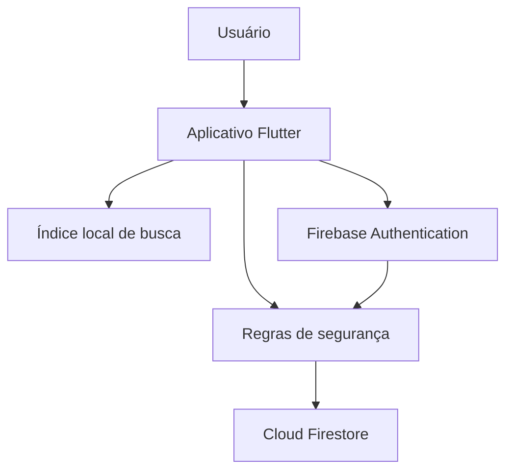

# Arquitetura

## Visão geral

O Hinos IBIJ combina um índice local otimizado para pesquisa aproximada com dados operacionais mantidos no Cloud Firestore. O Firebase Authentication identifica os responsáveis autorizados a criar ou alterar cultos.

## Organização do código

| Arquivo | Responsabilidade principal |
|---|---|
| `lib/main.dart` | Inicialização, navegação e coordenação das formas de consulta |
| `lib/servico_busca_hinos.dart` | Carregamento do índice local, normalização e relevância da busca textual |
| `lib/tela_letra_hino.dart` | Apresentação das estrofes para conferência |
| `lib/tela_cultos.dart` | Consulta, criação e edição de cultos e seus hinos |
| `lib/tela_acesso.dart` | Login, saída e recuperação de senha |
| `firestore.rules` | Autorização das leituras e escritas no banco |
| `tools/` | Validação, importação controlada e testes de consulta |

## Fontes de dados

### Índice local

O arquivo `assets/indice_busca_hinos.json` atende à pesquisa aproximada por título ou trecho da letra. Ele evita transferir toda a base do Firestore em cada busca e permite calcular relevância no dispositivo.

Esse índice é um artefato derivado e privado. O repositório contém apenas um exemplo fictício da sua estrutura.

### Cloud Firestore

O Firestore mantém os registros atuais usados nas consultas e no planejamento dos cultos. As coleções centrais são:

- `hinos_v2`: metadados, assuntos, tonalidade, estrofes e vínculo entre correspondentes;
- `cultos_v2`: data, horário, observações e demais informações do culto;
- `itens_culto_v2`: hinos escolhidos, ordem e tonalidade de execução;
- `usuarios`: perfil, situação e papel de autorização.

## Fluxos principais

### Consulta por número

1. O usuário escolhe CC ou VM e informa o número.
2. O aplicativo consulta o documento correspondente.
3. Quando há vínculo entre as versões, também recupera o hino do outro livro.
4. A interface apresenta título, tonalidade, assuntos, correspondente e informações de uso.

### Consulta por assunto

1. O usuário seleciona um assunto.
2. O aplicativo consulta os hinos classificados com esse assunto.
3. O resultado escolhido é carregado no cartão de apresentação.

### Consulta por texto

1. O usuário informa um título ou trecho.
2. O serviço normaliza a consulta e compara seus termos com o índice local.
3. Os resultados são classificados por relevância.
4. A seleção recupera no Firestore os dados atuais do hino.

### Planejamento de cultos

1. Qualquer usuário pode consultar os cultos.
2. Um responsável autenticado e autorizado cria ou edita o culto.
3. Os hinos são adicionados, removidos ou reordenados.
4. A tonalidade usada no culto pode ser ajustada sem alterar o cadastro original do hino.
5. A data e o horário determinam automaticamente se o culto está planejado ou realizado.

## Autenticação e autorização

O Firebase Authentication realiza o login por e-mail e senha. A autorização efetiva não depende apenas de estar autenticado: as regras consultam o documento do usuário e exigem situação ativa e papel de editor ou administrador para operações de escrita.

As leituras necessárias ao uso público permanecem liberadas. Coleções ou caminhos não declarados são negados pela regra padrão.

## Decisões arquiteturais

- **Busca textual local:** reduz leituras, melhora a resposta e permite classificação aproximada no dispositivo.
- **Firestore como fonte operacional:** mantém hinos e cultos consistentes entre os usuários.
- **Leitura pública e escrita restrita:** atende ao uso comunitário sem liberar a administração.
- **Tonalidade de execução separada:** preserva o tom cadastrado e registra a necessidade específica de cada culto.
- **Estado do culto derivado da data:** evita manutenção manual desnecessária.
- **Base real fora do Git:** protege conteúdo, reduz o repositório e evita publicação acidental de exportações.

## Configuração por ambiente

Os arquivos gerados pelo FlutterFire são locais e ficam fora do controle de versão. Cada colaborador deve executar `flutterfire configure` para associar sua cópia do aplicativo ao projeto Firebase apropriado.

Credenciais administrativas usadas pelos scripts Python são fornecidas exclusivamente pela variável `GOOGLE_APPLICATION_CREDENTIALS`.

## Evolução planejada

Uma futura arquitetura multi-instituição deverá incluir um identificador de igreja nos dados operacionais e nas autorizações. Essa mudança precisa ser acompanhada por migração controlada, consultas compostas, índices do Firestore e regras que imponham isolamento entre organizações.
